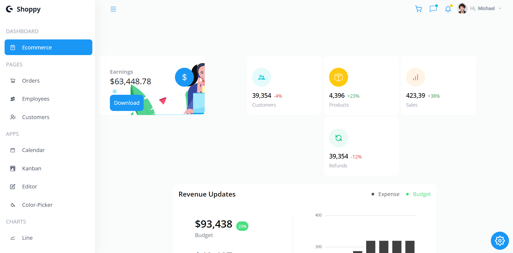

<h1>React Learning App - Movieland 
</h1>

## 1. Preview

This is my React Learning App which I learning from this youtuber channel:

- [https://www.youtube.com/watch?v=jx5hdo50a2M](https://www.youtube.com/watch?v=jx5hdo50a2M)



> demo page: [https://mr-addict.github/dashboard-react](https://mr-addict.github.io/dashboard-react)

## 2. Commands

### create

```bash
npx create-react-app dashboard-react
```

### start

```bash
npm start
```

### build

```bash
npm run build 
```
